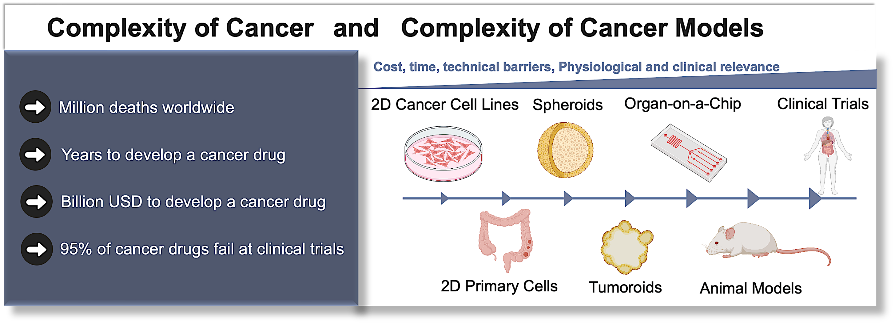

## My Research Odyssey, Understanding Cancer Vulnerabilities

When we think about cancer, it's a disease that takes millions of lives each year. However, developing new drugs to fight it is incredibly challenging. It takes ⏳ a long time and 💰 costs a lot of money, and unfortunately, most of the drugs don't even work.

Immortal 2D cancer cell lines 🧫 are mostly used in cancer research, which isn't very helpful in depicting the intricate communication among cancer cells in their niche. Hence, using cancer cells grown in 3D culture 🦠, such as spheroids or tumoroids, could be much better for finding treatments that actually work.

Moreover, the advancements in computational biology have greatly aided in handling large datasets and visualizing intricate details of cancer progression, which can improve treatment strategy.

⭐ ⭐ ⭐ ⭐ ⭐ 

That's where my interest in the tumoroid niche 🔍🦠, including cancer stem cells (CSCs), data analysis and visualization, comes in. 💥 My passion is to understand how cancer begins and interacts with its surrounding to find effective therapy.

👉 [Here](ResearchOdyssey.md), is my research odyssey in detail.

👉 [Here](ResOdyssey_Highlights.pdf), is a summary of its key highlights